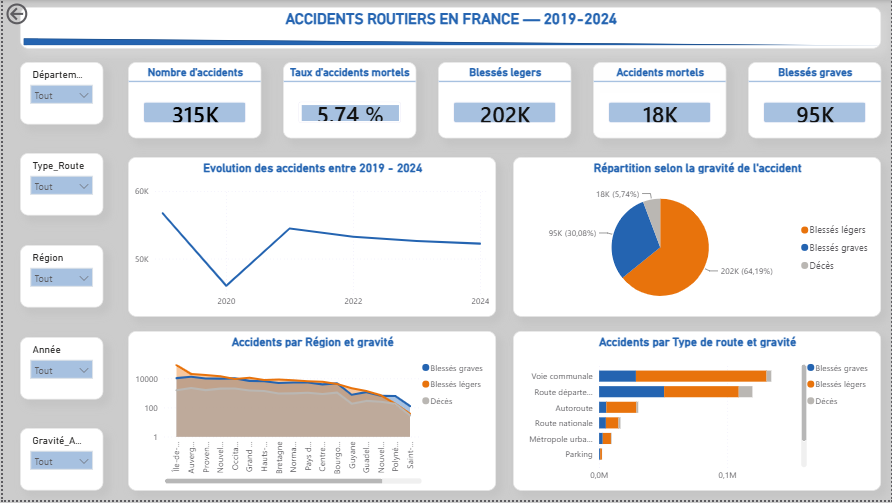
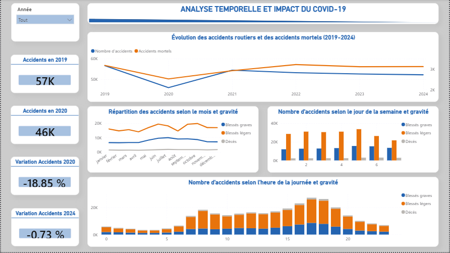
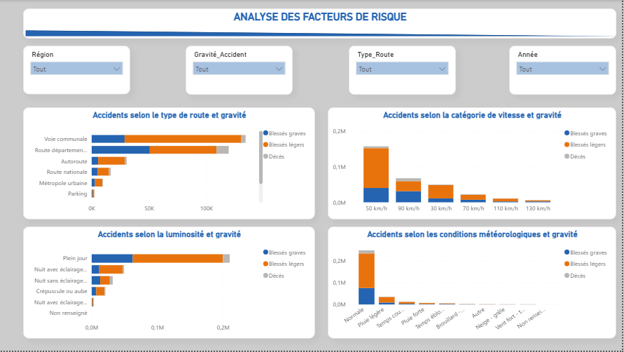
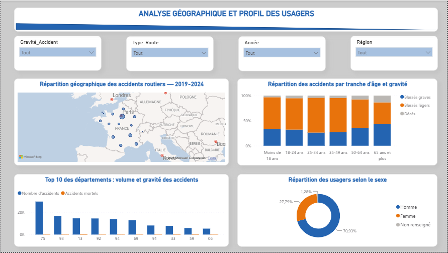

# Projet Final Data Analyst – Analyse des accidents routiers en France (2019–2024)

## Objectif
Analyser les accidents corporels de la circulation en France entre 2019 et 2024 à partir des données BAAC de l’ONISR, afin d’identifier les tendances temporelles, les zones à risque, les facteurs associés à la gravité des accidents et les profils les plus représentés.

## Technologies
- Python : Pandas, NumPy, Matplotlib, Seaborn, Scikit-learn
- Power BI : Power Query, DAX, visualisations interactives
- Machine Learning : Random Forest
- Jupyter Notebook

## Contenu
- `analyse_accidents_2019_2024.ipynb` : nettoyage, fusion, transformation et analyse exploratoire des données
- `modelisation_random_forest.ipynb` : modélisation et évaluation du modèle prédictif
- `dashboard_accidents_2019_2024.pbix` : tableau de bord interactif Power BI
- `presentation_projet.pdf` : synthèse des résultats, recommandations et limites de l’étude

## Principaux résultats
L’étude porte sur plus de 327 000 accidents corporels et met en évidence les principales tendances temporelles et géographiques ainsi que les facteurs associés à leur gravité. Un modèle Random Forest a également été développé pour explorer la prédiction des accidents mortels, avec une attention particulière portée au déséquilibre des classes.

## Ouvrir le projet
Téléchargez ou clonez le dépôt, puis ouvrez les notebooks avec Jupyter Notebook et le fichier `.pbix` avec Power BI Desktop.

## Aperçu du dashboard Power BI

Le rapport Power BI permet d'explorer les accidents routiers en France entre 2019 et 2024 à travers quatre axes d'analyse.

### 1. Vue d'ensemble
Synthèse des principaux indicateurs : nombre d'accidents, gravité, accidents mortels, évolution annuelle et répartition par région et type de route.

### 2. Analyse temporelle et impact du Covid-19
Analyse de l'évolution des accidents entre 2019 et 2024, avec un focus sur l'impact de l'année 2020 ainsi que les variations mensuelles, hebdomadaires et horaires.

### 3. Analyse des facteurs de risque
Étude des accidents selon le type de route, la vitesse, la luminosité et les conditions météorologiques.

### 4. Analyse géographique et profil des usagers
Analyse de la répartition géographique des accidents et des profils des usagers selon l'âge, le sexe et la gravité.

